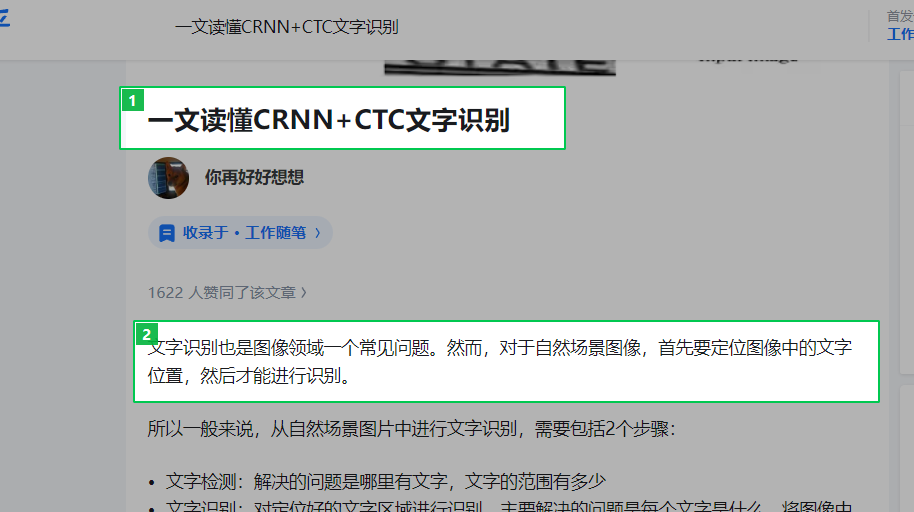

<p align="center">
  
</p>

<h2 align="center">Ai_Flow — 截图解析悬浮窗</h2>

<p align="center">
  <b>截图 + 多模态大模型 / OCR → 流式输出到悬浮窗</b>
</p>

---

## 这是什么

启动后桌面常驻悬浮窗，底部输入框可直接打字对话。按下快捷键截取屏幕任意区域，大模型解析或 OCR 识别后结果流式显示。

- 纯文本对话：底部输入框打字，Enter 发送
- 截图提问：`Ctrl+D` 连续截图，缩略图累积，点发送统一提交
- OCR 识别：`Ctrl+R` 截图，腾讯云 OCR 返回可复制文字

## 操作演示

悬浮窗常驻桌面，底部随时打字。`Ctrl+F` 隐藏/显示。


`Ctrl+D` 进入截图，拖拽松手自动确认变绿，连续多框。`Ctrl+Z` 撤销。




框选完 Enter 放入对话框，缩略图累积，可删除单张。输入文字点发送。


## 快捷键

| 快捷键 | 功能 |
|--------|------|
| `Ctrl+D` | 截图发送 |
| `Ctrl+R` | OCR 文字识别 |
| `Ctrl+F` | 隐藏/显示窗口 |

## 功能

| 功能 | 说明 |
|------|------|
| 常驻悬浮窗 | 启动即显示，可拖拽移动、四角缩放、半透明置顶 |
| 连续截图 | 松手自动确认，多框同时提交，Ctrl+Z 撤销 |
| 缩略图预览 | 截图累积显示在输入框上方，可单独删除 |
| 多模态 AI | 豆包 VL，支持多图 + 文字混合输入 |
| 流式输出 | 逐字显示，Markdown 渲染 |
| 多轮对话 | 上下文自动管理 |
| OCR 识别 | 腾讯云 OCR，免费 1000 次/月 |
| 模型切换 | mini / lite / pro 三档随时切换 |
| 即时设置 | 悬浮窗底部按钮，随时配置 API Key / OCR 凭证 |
| 系统托盘 | 最小化到托盘，右键菜单操作 |
| 跨平台 | Windows / Mac / Linux |

## 快速上手

### 安装

```bash
git clone https://github.com/zebinlu7-a11y/screen-flow-ai-agent.git
cd screen-flow-ai-agent
pip install -r requirements.txt
pip install volcenginesdkarkruntime
```

### 配置

启动后点悬浮窗底部设置按钮，填写：

| 配置项 | 获取地址 |
|--------|----------|
| API Key | [console.volcengine.com/ark/region:ark+cn-beijing/apiKey](https://console.volcengine.com/ark/region:ark+cn-beijing/apiKey) |
| 代理 | 如 `http://127.0.0.1:7897`，不需要则留空 |
| OCR 凭证 | [console.cloud.tencent.com/cam/capi](https://console.cloud.tencent.com/cam/capi)（可选） |

### 启动

```bash
python main.py
```

## 下载

[**Ai_Flow.zip**](https://github.com/zebinlu7-a11y/screen-flow-ai-agent/releases/download/v1.0/Ai_Flow.zip)（75MB），解压双击 `Ai_Flow.exe` 运行。

## 项目结构

```text
Ai_Flow/
├── main.py              # 主入口
├── config.py            # 配置
├── requirements.txt     # 依赖
│
├── agent/               # 大模型调用
│   ├── state.py
│   ├── graph.py
│   └── llm_client.py
│
├── gui/                 # 界面
│   ├── capture_window.py   # 截图遮罩
│   ├── input_widget.py     # 输入弹窗
│   ├── result_window.py    # 悬浮窗
│   └── api_key_dialog.py   # 设置
│
├── utils/               # 工具
│   ├── image_tool.py
│   ├── ocr_tool.py
│   ├── context_store.py
│   └── api_key_manager.py
│
└── assets/              # 截图和图标
```

## License

MIT © [zebinlu7-a11y](https://github.com/zebinlu7-a11y)
