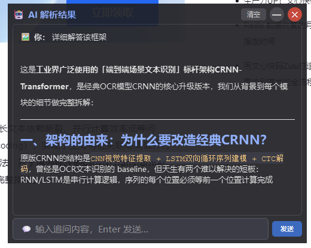
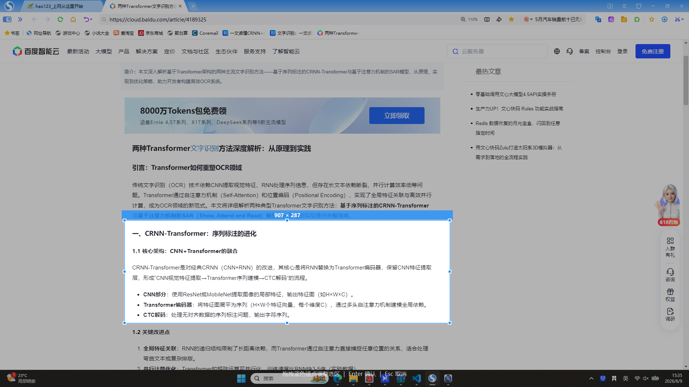
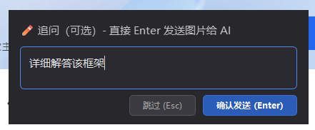

<p align="center">
  
</p>

<h1 align="center">Ai_Flow — 智能截图 AI 助手</h1>

<p align="center">
  <b>截图 → AI 多模态解析 / OCR 文字识别 → 悬浮窗流式输出</b>
</p>

<p align="center">
  
  
  
  
  
  
</p>

---

## 🎯 这是什么？

**Ai_Flow** 是一个跨平台桌面 AI 助手。程序启动后常驻悬浮窗：

- 💬 **纯文本对话**：直接在底部输入框打字，Enter 发送，AI 流式回复
- 🖼️ **截图 + 提问**：`Ctrl+D` 连续截图，缩略图累积，一键发送给 AI 解析
- 🔍 **OCR 文字识别**：`Ctrl+R` 截图 → 腾讯云 OCR 识别 → 文字直接可复制

---

## 📸 操作演示

### 日常对话 & 截图提问



> 悬浮窗常驻桌面，底部输入框随时打字对话。`Ctrl+F` 隐藏/显示。

### 截图 → 连续多框 → 缩略图累积



> `Ctrl+D` 进入截图，拖拽画框松手自动确认，可连续画多个框。



> 框选完成后 Enter 全部放入对话框，缩略图累积显示，可 ✕ 删除单张。输入文字后点"发送"统一提交。

---

## ⌨️ 快捷键

| 快捷键 | 功能 |
|--------|------|
| `Ctrl+D` | 截图发送 — 连续画框 → Enter 放入对话框 → 发送 AI 解析 |
| `Ctrl+R` | OCR 识别 — 截图后腾讯云 OCR 返回可复制文字 |
| `Ctrl+F` | 隐藏 / 显示悬浮窗 |

---

## ✨ 功能特性

| 功能 | 说明 |
|------|------|
| 🪟 **常驻悬浮窗** | 启动即显示，可拖拽移动 + 四角缩放，半透明置顶 |
| 🔍 **连续截图** | 松手自动确认，支持多框同时提交，Ctrl+Z 撤销 |
| 🖼️ **缩略图预览** | 截图累积显示在输入框上方，可 × 单独删除 |
| 🧠 **多模态 AI** | LangGraph 状态机编排，多图 + 文字混合输入 |
| 💬 **流式输出** | 逐字打字效果，Markdown 渲染 |
| 🔄 **多轮对话** | 上下文自动管理，Token 滑窗裁剪 |
| 🔤 **OCR 识别** | 腾讯云 OCR，免费 1000 次/月 |
| 🎛️ **模型切换** | mini / lite / pro 三档随时切换 |
| ⚙️ **即时设置** | 悬浮窗底部 ⚙ 按钮，随时配置 API Key / OCR 凭证 |
| 📌 **系统托盘** | 最小化到托盘，右键菜单操作 |
| 🌍 **跨平台** | pynput 快捷键，Windows / Mac / Linux 通用 |

---

## 🚀 快速上手

### 1. 安装依赖

```bash
git clone https://github.com/zebinlu7-a11y/screen-flow-ai-agent.git
cd screen-flow-ai-agent
pip install -r requirements.txt
```

额外安装火山引擎 SDK（联系作者或从火山引擎获取）：
```bash
pip install volcenginesdkarkruntime
```

### 2. 配置凭证

启动程序后，点击悬浮窗底部 **⚙** 按钮，填写：

| 配置项 | 说明 | 获取地址 |
|--------|------|----------|
| API Key | 豆包方舟 API Key | https://console.volcengine.com/ark |
| 代理地址 | HTTP 代理（如需） | 如 `http://127.0.0.1:7897` |
| SecretId/Key | 腾讯云 OCR 凭证 | https://console.cloud.tencent.com/cam/capi |

> OCR 凭证可选填，不填则 Ctrl+R 不可用，不影响截图 + AI 功能。

### 3. 启动

```bash
python main.py
```

---

## 📦 下载 exe

从 [Releases](https://github.com/zebinlu7-a11y/screen-flow-ai-agent/releases) 下载 `Ai_Flow.zip`，解压双击 `Ai_Flow.exe` 运行。

---

## 📁 项目结构

```text
Ai_Flow/
├── main.py                 # 主入口：热键、信号串联、AI/OCR 流程
├── config.py               # 全局配置（快捷键、Token、模型列表）
├── build_exe.py            # PyInstaller 打包脚本
├── requirements.txt        # Python 依赖
│
├── agent/                  # LangGraph AI 编排
│   ├── state.py            # AgentState 状态定义
│   ├── graph.py            # 图拓扑：trim → call_vlm
│   └── llm_client.py       # 豆包 VL LangChain 客户端
│
├── gui/                    # PyQt6 UI
│   ├── capture_window.py   # 连续多框截图遮罩
│   ├── input_widget.py     # 追问输入弹窗（缩略图预览）
│   ├── result_window.py    # 常驻悬浮窗（结果 + 输入 + 缩略图）
│   └── api_key_dialog.py   # 设置弹窗（API Key/代理/OCR）
│
├── utils/                  # 工具模块
│   ├── image_tool.py       # 图片压缩、格式转换、Base64
│   ├── token_counter.py    # Token 估算 + 历史裁剪
│   ├── context_store.py    # 对话上下文 JSON 持久化
│   ├── api_key_manager.py  # 配置存取（JSON）
│   └── ocr_tool.py         # 腾讯云 OCR 封装
│
└── assets/                 # 图标和截图
```

---

## 🛠️ 技术栈

- **Python 3.9+** · **PyQt6** · **LangGraph** · **LangChain Core**
- **豆包 VL**（火山引擎方舟）· **腾讯云 OCR**
- **pynput**（跨平台快捷键）· **Pillow**（图片处理）

---

## 📄 License

MIT © [zebinlu7-a11y](https://github.com/zebinlu7-a11y)

---

<p align="center">
  ⭐ 如果这个项目对你有用，欢迎点个 Star！
</p>
